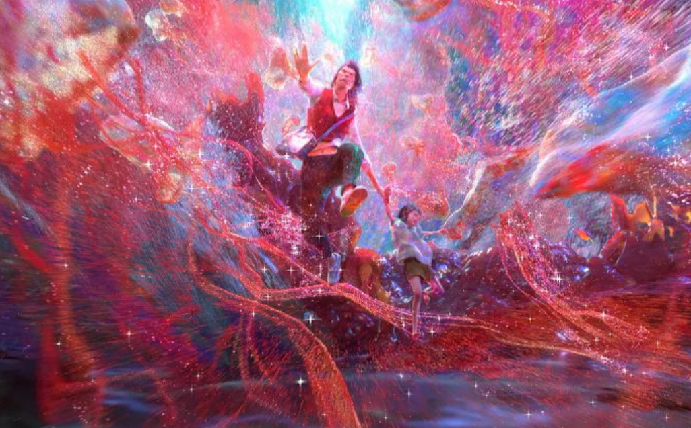
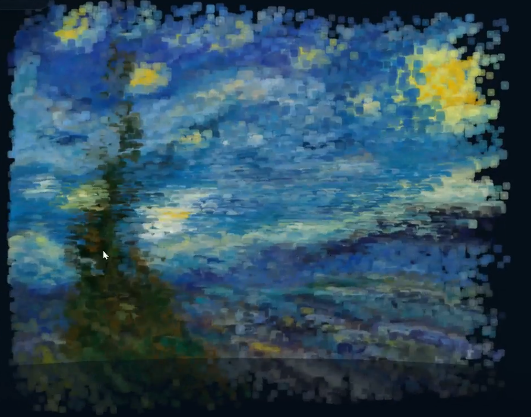
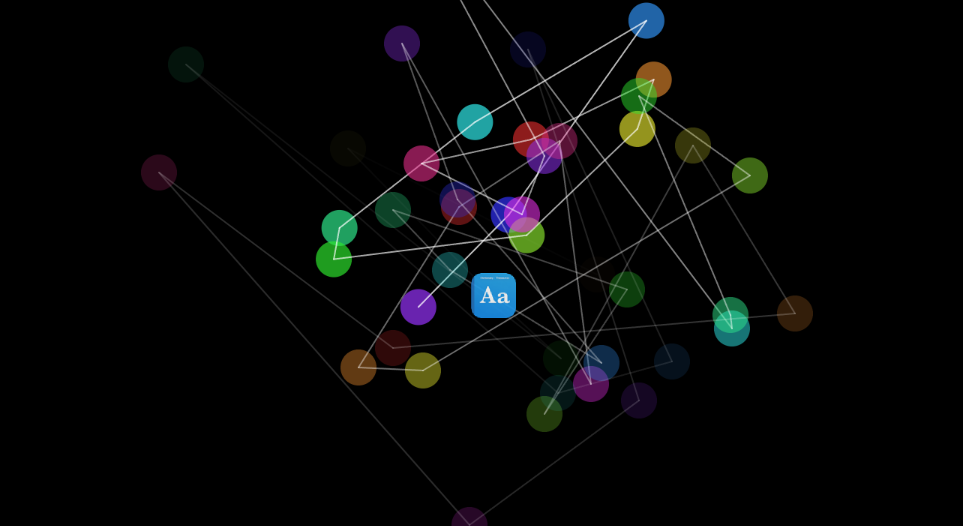

# Quiz8  Dot-based ink art
I want to choose dot-based ink art as the visual style for my project. I would like to present part of the artwork using this technique because it creates a stronger sense of depth and layering. Transforming the image into a dot-based ink composition also makes it more flexible and adaptable, allowing the artwork to be viewed and interpreted from different perspectives. In addition, the number of particles or dots can be freely adjusted to create a variety of visual effects and artistic expressions.

## Example pictures:

## Coding Technique Exploration

A particle system in p5.js can help create the dot-based ink effect by generating thousands of animated particles to form an image. The particles can move, overlap, and change density to create a layered and dynamic visual style. This technique is useful because it allows the artwork to transform from different viewing angles while maintaining the overall composition. By adjusting the number, size, and movement of particles, different visual effects and artistic expressions can be achieved.

## Here is the link to the coding technique.
https://p5js.org/examples/classes-and-objects-connected-particles/?utm_source=chatgpt.com

## Example pictures:

## here is the code 
// Array of path objects, each containing an array of particles
let paths = [];

// How long until the next particle
let framesBetweenParticles = 5;
let nextParticleFrame = 0;

// Location of last created particle
let previousParticlePosition;

// How long it takes for a particle to fade out
let particleFadeFrames = 300;

function setup() {
  createCanvas(720, 400);
  colorMode(HSB);

  // Start with a default vector and then use this to save the position
  // of the last created particle
  previousParticlePosition = createVector();
  describe(
    'When the cursor drags along the black background, it draws a pattern of multicolored circles outlined in white and connected by white lines. The circles and lines fade out over time.'
  );
}

function draw() {
  background(0);

  // Update and draw all paths
  for (let path of paths) {
    path.update();
    path.display();
  }
}

// Create a new path when mouse is pressed
function mousePressed() {
  nextParticleFrame = frameCount;
  paths.push(new Path());

  // Reset previous particle position to mouse
  // so that first particle in path has zero velocity
  previousParticlePosition.set(mouseX, mouseY);
  createParticle();
}

// Add particles when mouse is dragged
function mouseDragged() {
  // If it's time for a new point
  if (frameCount >= nextParticleFrame) {
    createParticle();
  }
}

function createParticle() {
  // Grab mouse position
  let mousePosition = createVector(mouseX, mouseY);

  // New particle's velocity is based on mouse movement
  let velocity = p5.Vector.sub(mousePosition, previousParticlePosition);
  velocity.mult(0.05);

  // Add new particle
  let lastPath = paths[paths.length - 1];
  lastPath.addParticle(mousePosition, velocity);

  // Schedule next particle
  nextParticleFrame = frameCount + framesBetweenParticles;

  // Store mouse values
  previousParticlePosition.set(mouseX, mouseY);
}

// Path is a list of particles
class Path {
  constructor() {
    this.particles = [];
  }

  addParticle(position, velocity) {
    // Add a new particle with a position, velocity, and hue
    let particleHue = (this.particles.length * 30) % 360;
    this.particles.push(new Particle(position, velocity, particleHue));
  }

  // Update all particles
  update() {
    for (let particle of this.particles) {
      particle.update();
    }
  }

  // Draw a line between two particles
  connectParticles(particleA, particleB) {
    let opacity = particleA.framesRemaining / particleFadeFrames;
    stroke(255, opacity);
    line(
      particleA.position.x,
      particleA.position.y,
      particleB.position.x,
      particleB.position.y
    );
  }

  // Display path
  display() {
    // Loop through backwards so that when a particle is removed,
    // the index number for the next loop will match up with the
    // particle before the removed one
    for (let i = this.particles.length - 1; i >= 0; i -= 1) {
      // Remove this particle if it has no frames remaining
      if (this.particles[i].framesRemaining <= 0) {
        this.particles.splice(i, 1);

        // Otherwise, display it
      } else {
        this.particles[i].display();

        // If there is a particle after this one
        if (i < this.particles.length - 1) {
          // Connect them with a line
          this.connectParticles(this.particles[i], this.particles[i + 1]);
        }
      }
    }
  }
}

// Particle along a path
class Particle {
  constructor(position, velocity, hue) {
    this.position = position.copy();
    this.velocity = velocity.copy();
    this.hue = hue;
    this.drag = 0.95;
    this.framesRemaining = particleFadeFrames;
  }

  update() {
    // Move it
    this.position.add(this.velocity);

    // Slow it down
    this.velocity.mult(this.drag);

    // Fade it out
    this.framesRemaining = this.framesRemaining - 1;
  }

  // Draw particle
  display() {
    let opacity = this.framesRemaining / particleFadeFrames;
    noStroke();
    fill(this.hue, 80, 90, opacity);
    circle(this.position.x, this.position.y, 24);
  }
}